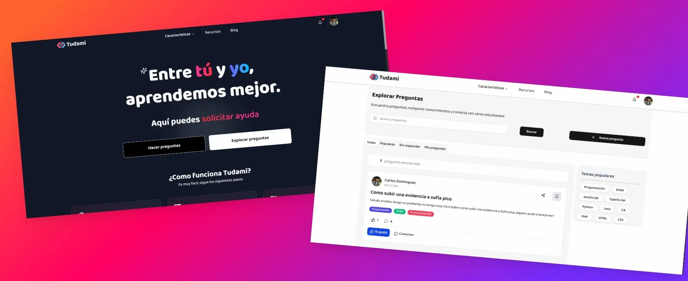

<div align="center">
  
  <h1>Tudami</h1>
  <p><strong>Tu comunidad para aprender, preguntar y crecer.</strong></p>
</div>

## ¿Qué es Tudami?

**Tudami** es una plataforma de preguntas y respuestas diseñada para conectar a personas que buscan conocimiento con aquellas que desean compartirlo. ¿Tienes una duda sobre programación, diseño, o cualquier otro tema? ¡Publícala en Tudami y recibe ayuda de una comunidad de expertos y entusiastas!

Nuestra misión es crear un espacio abierto y colaborativo donde el aprendizaje sea accesible para todos. En Tudami, puedes:

- **Hacer preguntas:** Publica tus dudas y obtén respuestas claras y precisas.
- **Compartir tu conocimiento:** Ayuda a otros respondiendo sus preguntas y gana reconocimiento.
- **Crear tu perfil:** Muestra tus habilidades e intereses.
- **Explorar contenido:** Descubre nuevas preguntas y temas de tu interés.

---

## Información Técnica

Para los curiosos de la tecnología, aquí hay un vistazo de cómo está construido Tudami.

### Arquitectura y Tecnologías

Este proyecto está desarrollado con un stack moderno de JavaScript, enfocado en el rendimiento y la escalabilidad.

- **Framework Principal:** [Next.js](https://nextjs.org/) (con React y TypeScript) - Nos permite tener una aplicación web rápida y optimizada para SEO.
- **Estilos:** [Tailwind CSS](https://tailwindcss.com/) - Un framework de CSS que nos ayuda a construir interfaces de usuario de forma ágil y consistente.
- **Componentes de UI:** [Radix UI](https://www.radix-ui.com/) y [Lucide Icons](https://lucide.dev/) - Para crear componentes accesibles y visualmente atractivos.
- **Gestión de Estado:** [Zustand](https://zustand-demo.pmnd.rs/) - Una solución simple y potente para manejar el estado de la aplicación.
- **Base de Datos y Autenticación:** [Supabase](https://supabase.io/) - Usamos Supabase como nuestra solución de backend, que nos provee de una base de datos, autenticación y más.
- **Formularios:** [React Hook Form](https://react-hook-form.com/) y [Zod](https://zod.dev/) - Para construir formularios robustos con validación de datos.

### Estructura del Proyecto

El código está organizado siguiendo las convenciones de Next.js, con una clara separación de responsabilidades para mantener el proyecto ordenado y escalable:

```
/public             # Contiene todos los archivos estáticos como imágenes, fuentes y SVGs.
/src
|-- /app            # Páginas y rutas de la aplicación (App Router de Next.js).
|-- /components     # Componentes de React reutilizables en toda la aplicación.
|-- /content        # Contenido estático o datos, como archivos JSON.
|-- /context        # Contextos de React para la gestión del estado global (ej. sesión de usuario).
|-- /hooks          # Hooks personalizados de React para lógica reutilizable.
|-- /lib            # Módulos y funciones de utilidad (ej. conexión con Supabase, utils de Tiptap).
|-- /styles         # Estilos globales y variables SASS.
|-- /utils          # Funciones de utilidad generales (ej. formateo de fechas).
|-- middleware.ts   # Middleware de Next.js para gestionar rutas y sesiones.
```

¡Gracias por tu interés en Tudami! Si tienes alguna pregunta o sugerencia, no dudes en contactarnos.